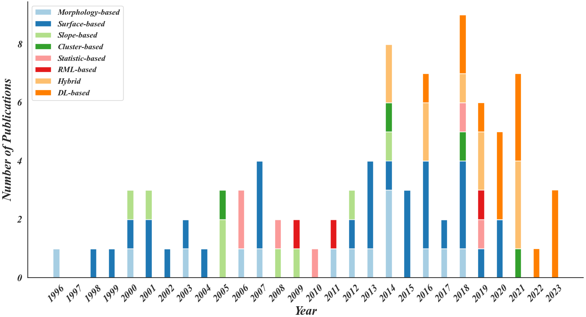

# Towards-Intelligent-GF
Towards Intelligent Ground Filtering of Large-Scale Topographic Point Clouds: A Comprehensive Survey

## Public Datasets
ISPRS-Filtertest:https://www.itc.nl/isprs/wgIII-3/filtertest 
OpenGF: https://github.com/Nathan-UW/OpenGF 
Forested environment: https://3decology.org/2023/06/21/benchmark-dataset-for-airborne-lidar-scanning-data-filtering-in-forested-environments-2/  

## Available Open-source Tools
### Free Software
ALDPAT: http://LiDAR.ihrc.fiu.edu/LiDARtool.html  
PCL: https://pointclouds.org/downloads/ 
PDAL: https://pdal.io 
FUSION/LDV: http://forsys.sefs.uw.edu/fusion/fusionlatest.html 
MCC-LiDAR: http://sourceforge.net/projects/mccLiDAR/develop 
BCAL LiDAR Tools: http://bcal.boisestate.edu/tools/LiDAR/ 
LASTools: http://www.cs.unc.edu/isenburg/lastools/ 
CloudCompare: https://www.cloudcompare.org 

### Public DL Models
VGG: https://github.com/machrisaa/tensorflow-vgg 
FCN: https://github.com/shelhamer/fcn.berkeleyvision.org 
PointNet/PointNet++: https://github.com/intel-isl/Open3D-PointNet2-Semantic3D 
MinkUNet: https://github.com/NVIDIA/MinkowskiEngine 
DGCNN: https://github.com/AnTao97/dgcnn.pytorch 
KPConv: https://github.com/HuguesTHOMAS/KPConv 
RandLA-Net: https://github.com/QingyongHu/RandLA-Net 
SCF-Net: https://github.com/leofansq/SCF-Net 

## Citation

If it is helpful for your work, please consider citing our paper:

    @inproceedings{qin2023towardsIGF,
        title={Towards Intelligent Ground Filtering of Large-Scale Topographic Point Clouds: A Comprehensive Survey},
        author={Qin, Nannan and Tan, Weikai and Guan, Haiyan and Wang, Lanying  and Ma, Lingfei and Tao, Pengjie and Fatholahi, Sarah and Hu, Xiangyun and Li, Jonathan},
        booktitle={Int. J. Appl. Earth Obs. Geoinf.},
        year={2023}
    }
